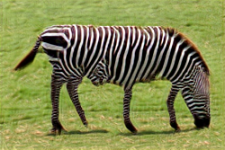
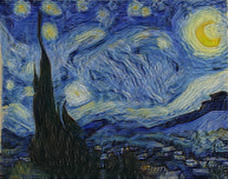

# cSinGAN

### Our attempt at using conditional GAN to improve "SinGAN: Learning a Generative Model from a Single Natural Image"

#### Yunke Zhao, Zhilin Guo, Xuejing Wang

#### COMS 4995 005 Deep Learning, Spring 2020

#### Department of Computer Science, School of Engineering and Applied Science, Columbia University

## Abstract
Image generation combined with deep learning has become a hot topic these years. Inspired by the SinGAN developed by Shaham et al., we implemented a new optimized conditional stack-GAN model, named cSinGAN, in this project to explore some more potential solution on image generation, and compare them with current models. In the end, our model sees FID score improvement on 4 out of 5 image inputs.

